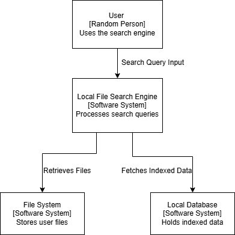
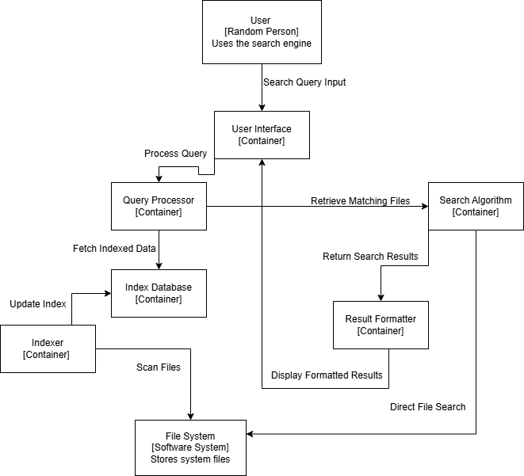
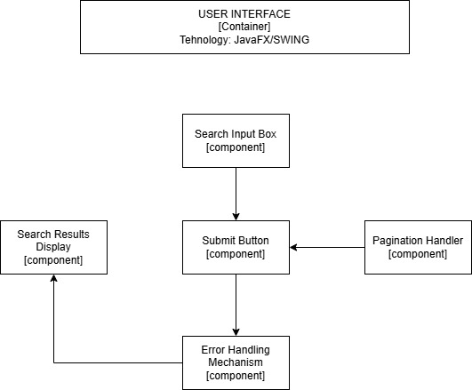
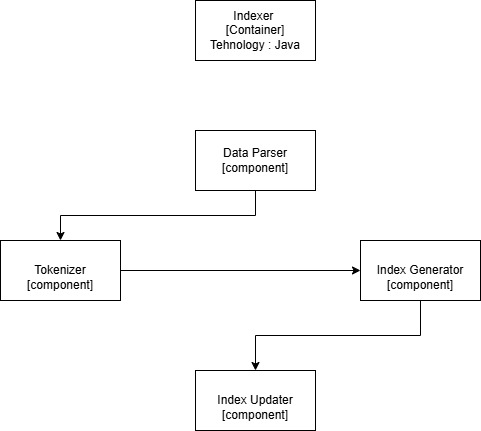

# Search Engine Architecture Documentation

## **1. Overview of Architecture**
The search engine system consists of three major architectural levels:

### **1.1 Level 1: Context Diagram**
The first level represents the high-level interaction of the system:
- The **User** interacts with the **Local File Search Engine**.
- The **Local File Search Engine** processes search queries.
- The **File System** stores user files.
- The **Local Database** holds indexed data used for search retrieval.
    

### **1.2 Level 2: Container Diagram**
At the second level, the system is divided into logical containers:
- **User Interface [Container]**: Manages user input and displays results.
- **Query Processor [Container]**: Parses, validates, and optimizes queries.
- **Search Algorithm [Container]**: Retrieves and ranks search results.
- **Result Formatter [Container]**: Formats results for display.
- **Index Database [Container]**: Stores indexed search data.
- **Indexer [Container]**: Processes raw documents and updates the index.
- **File System [Software System]**: Stores original files and metadata.

### **1.3 Level 3: Component Diagram (Inside Each Container)**
Each container consists of interconnected components that handle specific functionalities within the system.

